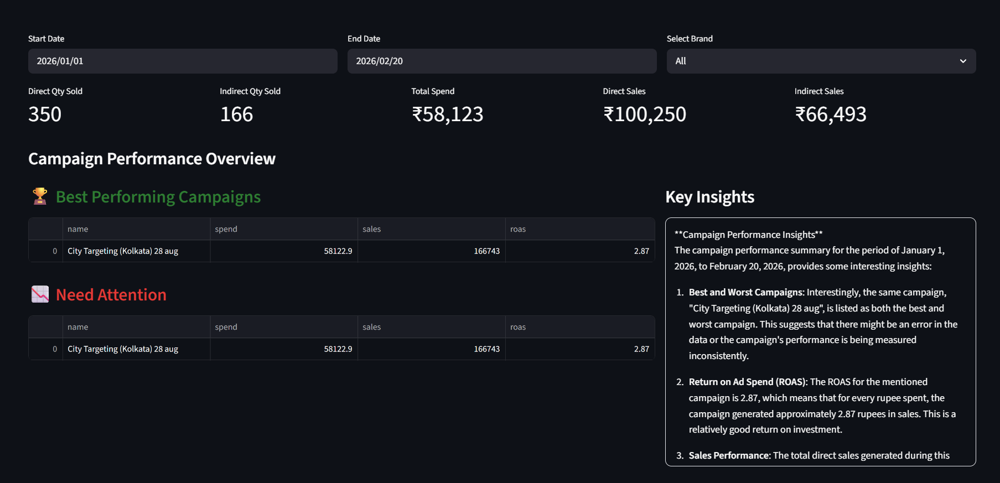
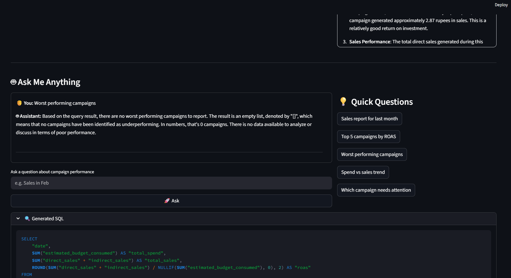

# 📊 Campaign Analytics Assistant

An AI-powered campaign analytics assistant that converts natural language questions into SQL queries and generates actionable marketing insights from campaign performance data.

Built using Streamlit, LangChain, OpenAI GPT, PostgreSQL, and SQLAlchemy.

---

# 📸 Screenshots

## 📊 Dashboard Overview

Shows campaign KPIs, best-performing campaigns, campaigns needing attention, and AI-generated business insights.



---

## 💬 Natural Language SQL Assistant

Ask questions in plain English and get generated SQL queries, insights, and campaign analysis instantly.



---

# ✨ Features

- 💬 Natural Language to SQL conversion
- 🤖 LLM-powered marketing insights
- 📈 Campaign performance analytics
- 🧠 Conversational memory support
- ⚡ Real-time PostgreSQL querying

---

# 🛠️ Tech Stack

### Backend & AI
- Python
- LangChain
- SQLAlchemy

### Database
- PostgreSQL

### Frontend
- Streamlit

---

# 🚀 What It Does

The system allows users to ask campaign-related questions in plain English such as:

```text
Which campaigns had the highest ROAS in the last 7 days?
```

or

```text
Show campaigns where spend increased but conversions dropped.
```

The assistant:
1. Converts the question into optimized SQL queries
2. Fetches live PostgreSQL campaign data
3. Generates LLM-powered business insights
4. Returns conversational analytics responses

---

# 📌 Key Functionalities

- Automated campaign monitoring
- ROAS, CPC, CTR, spend & conversion analysis
- Multi-campaign insight generation
- Conversational analytics assistant
- Data-driven optimization recommendations

---

# ⚙️ Setup Instructions

## 1️⃣ Clone Repository

```bash
git clone https://github.com/your-username/campaign-analytics-assistant.git
cd campaign-analytics-assistant
```

---

## 2️⃣ Install Dependencies

```bash
pip install -r requirements.txt
```

---

## 3️⃣ Create `.env` File

```env
OPENAI_API_KEY=your_openai_api_key

DB_HOST=localhost
DB_PORT=5432
DB_NAME=your_database_name
DB_USER=your_database_user
DB_PASSWORD=your_database_password
```

---

## 4️⃣ Run Application

```bash
streamlit run app.py
```

---

# 📂 Project Structure

```text
├── app.py
├── prompts.py
├── requirements.txt
├── .gitignore
└── README.md
```

---

